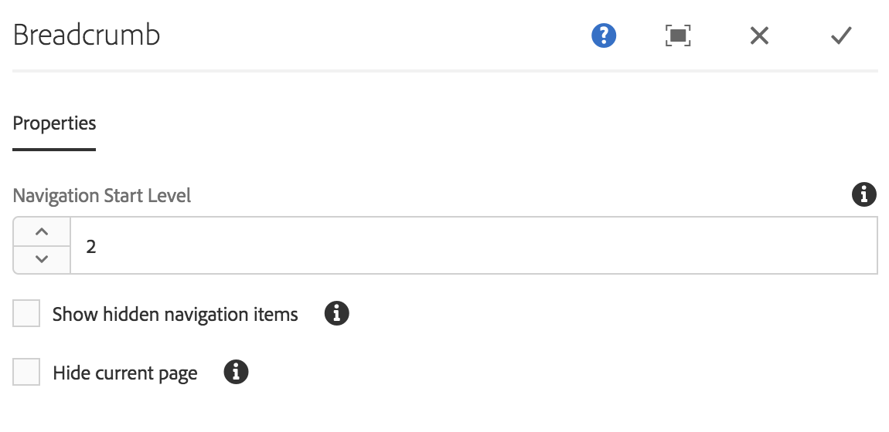

# Breadcrumb Component{#breadcrumb-component}

The Core Component Breadcrumb Component is a navigation component that builds a breadcrumb of links based on the page's location in the content hierarchy.

## Usage {#usage}

The Breadcrumb Component displays the position of the current page within the site hierarchy, allowing page visitors to navigate the page hierarchy from their current location. This is often integrated into page headers or footers.

Available options, such as the default navigation level and the ability to show the current page or hidden pages, can be defined by the template author in the [design dialog](#design-dialog). The content editor can then choose if hidden pages should be shown or not and the actual navigation level for the component in the [edit dialog](#edit-dialog).

## Version and Compatibility {#version-and-compatibility}

The current version of the Breadcrumb Component is v2, which was introduced with release 2.0.0 of the Core Components in January 2018, and is described in this document.

The following table details all supported versions of the component, the AEM versions with which the versions of the component is compatible, and links to documentation for previous versions.

|Component Version|AEM 6.3|AEM 6.4|AEM 6.5|
|--- |--- |--- |--- |
|v2|Compatible|Compatible|Compatible|
|[v1](breadcrumb-v1.md)|Compatible|Compatible|Compatible|

For more information about Core Component versions and releases, see the document [Core Components Versions](versions.md).

## Sample Component Output {#sample-component-output}

To experience the Breadcrumb Component as well as see examples of its configuration options as well as HTML and JSON output, visit the [Component Library](https://adobe.com/go/aem_cmp_library_breadcrumb).

>[!NOTE]
>
>As of Core Components release 2.1.0, the Breadcrumb Component supports [schema.org microdata](https://schema.org/BreadcrumbList).

## Technical Details {#technical-details}

The latest technical documentation about the Breadcrumb Component [can be found on GitHub](https://adobe.com/go/aem_cmp_tech_breadcrumb_v2).

Further details about developing Core Components can be found in the [Core Components developer documentation](developing.md).

## Edit Dialog {#edit-dialog}

The edit dialog allows the content author to suppress hidden and active pages in the breadcrumbs as well as the depth in the hierarchy it should display.

* **Navigation Start Level** - Where in the hierarchy the breadcrumb component should start to walk down to the current page. For example in We.Retail:

    * 0 starts at `/content`  
    
    * 1 starts at `/content/we-retail`
    * 2 starts at `/content/we-retail/<country>`

* **Show hidden navigation items** - Show pages marked as hidden in the breadcrumb (by default they will not be displayed)
* **Hide current page**- Suppress the current page in the breadcrumb (by default it will be displayed)

## Design Dialog {#design-dialog}

The design dialog allows the template author to define what the default values are for the options to suppress hidden and active pages in the breadcrumbs as well as the depth in the hierarchy it should display.

### Main Tab {#main-tab}

* **Navigation Start Level** - Defines the default value for where in the hierarchy the breadcrumb component should start to walk down to the current page when the breadcrumb component is added to a page.
* **Show hidden navigation items** - Defines the default value of the **Show hidden navigation items** option when the breadcrumb component is added to a page.

    * It does not enable or disable the option for the author. It only sets the default value.

* **Hide current page**- Defines the default value of the **Hide current page** option when the breadcrumb component is added to a page.

    * It does not enable or disable the option for the author. It only sets the default value.

### Styles Tab {#styles-tab}

The Breadcrumb Component supports the AEM [Style System](authoring.md#component-styling).