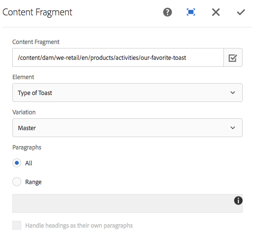

# Content Fragment List Component{#content-fragment-list-component}

The Core Component Content Fragment List component allows for the display of a list of [content fragments](https://helpx.adobe.com/experience-manager/6-5/assets/using/content-fragments.html).

## Usage {#usage}

The Core Component Content Fragment List Component allows for the inclusion of a list of [content fragments](https://helpx.adobe.com/experience-manager/6-5/assets/using/content-fragments.html) on a page based on a Content Fragment model. This can be especially useful for creating [headless content](https://helpx.adobe.com/experience-manager/6-5/sites/developing/user-guide.html?topic=/experience-manager/6-5/sites/developing/morehelp/headless.ug.js) that can be easily consumed by other applications.

* The list and its properties can be selected in the [edit dialog](#edit-dialog).
* Resource types to handle certain images and grids can be defined in the [design dialog](#design-dialog).
* The edit option will open the selected fragment within the [content fragment editor](https://helpx.adobe.com/content/help/en/experience-manager/6-5/assets/using/content-fragments.html).

## Version and Compatibility {#version-and-compatibility}

The current version of the Content Fragment Component is v1, which was introduced with release 2.4.0 of the Core Components in May 2019, and is described in this document.

The following table details all supported versions of the component, the AEM versions with which the versions of the component is compatible, and links to documentation for previous versions.

|Component Version|AEM 6.3|AEM 6.4|AEM 6.5|
|--- |--- |--- |---|
|v1|Compatible|Compatible|Compatible|

For more information about Core Component versions and releases, see the document [Core Components Versions](versions.md).

## Sample Component Output {#sample-component-output}

To experience the Content Fragment List Component as well as see examples of its configuration options as well as HTML and JSON output, visit the [Component Library](http://opensource.adobe.com/aem-core-wcm-components/library/content-fragment-list.html).

## Technical Details {#technical-details}

The latest technical documentation about the Content Fragment List Component [can be found on GitHub](https://github.com/adobe/aem-core-wcm-components/blob/master/content/src/content/jcr_root/apps/core/wcm/components/contentfragmentlist/v1/contentfragmentlist).

Further details about developing Core Components can be found in the [Core Components developer documentation](developing.md). 

## Edit Dialog {#edit-dialog}

The configure dialog allows the content author to define the which content fragments comprise the list and the elements of those fragments to be included.

* **Model Path** - Path to the Content Fragment Model on which the list is based.
* **Parent Path** - Parent path from which the list should be built.
* **Tag Names** - Tag names for filtering the list.
* **Element Names** - Element names for limiting the model data displayed in the result.

## Design Dialog {#design-dialog}

The design dialog allows the template author to define the resource types used to handle mixed-media images and responsive grids.

* **Mixed-media image type**

  * A Sling resource type that is used for rendering mixed-media images

* **Internal responsive grid**

  * The Sling resource type that is used for the internal responsive grid