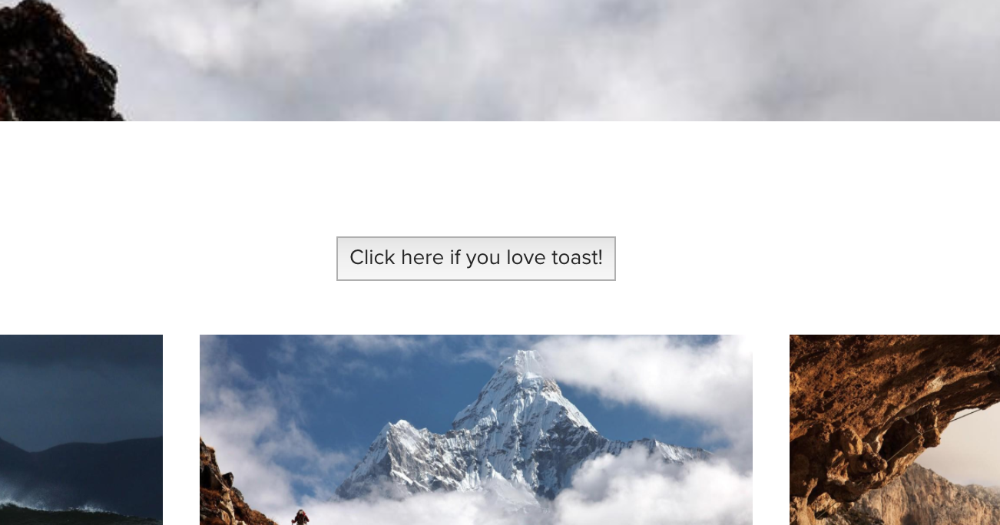

# Form Button Component{#form-button-component}

The Core Component Form Button Component allows for the inclusion of a button to trigger an action on a page.

## Usage {#usage}

The Core Component Form Button component allows for the creation of button field, often to trigger the submission of the form and is intended to be used along with the [Form Container component](form-container.md).

The button properties can be defined by the content editor in the [configure dialog](form-button.md#main-pars_title).

## Version and Compatibility {#version-and-compatibility}

The current version of the Form Button Component is v2, which was introduced with release 2.0.0 of the Core Components in January 2018, and is described in this document.

The following table details all supported versions of the component, the AEM versions with which the versions of the component is compatible, and links to documentation for previous versions.

|Component Version|AEM 6.3|AEM 6.4|AEM 6.5|
|--- |--- |--- |--- |
|v2|Compatible|Compatible|Compatible|
|[v1](form-button-v1.md)|Compatible|Compatible|Compatible|

For more information about Core Component versions and releases, see the document [Core Components Versions](versions.md).

## Sample Component Output {#sample-component-output}

The following is sample taken from [We.Retail](https://helpx.adobe.com/experience-manager/6-4/sites/developing/using/we-retail.html).

### Screenshot {#screenshot}

 

### HTML {#html}

```
<div class="container responsivegrid aem-GridColumn aem-GridColumn--default--12">
<form method="POST" action="/content/we-retail/us/en/experience.html" id="new_form" name="new_form" enctype="multipart/form-data" class="cmp-form aem-Grid aem-Grid--12 aem-Grid--default--12">
    <input type="hidden" name=":formstart" value="/content/we-retail/us/en/experience/jcr:content/root/responsivegrid/container">
    
    <div class="button aem-GridColumn aem-GridColumn--default--12">
<button type="BUTTON" class="cmp-form-button" name="loveToast" value="ILoveToast">Click here if you love toast!</button>
</div>

</form>
</div>
```

### JSON {#json}

```
"button":{  
                           "columnClassNames":"aem-GridColumn aem-GridColumn--default--12",
                           ":type":"core/wcm/sandbox/components/form/button/v2/button",
                           "name":"loveToast",
                           "jcr:title":"Click here if you love toast!",
                           "type":"button",
                           "value":"ILoveToast"
                        }
```

### Technical Details {#technical-details}

The latest technical documentation about the Form Button Component [can be found on GitHub](https://github.com/adobe/aem-core-wcm-components/blob/master/content/src/content/jcr_root/apps/core/wcm/components/form/button/v2/button).

Further details about developing Core Components can be found in the [Core Components developer documentation](developing.md). 

## Configure Dialog {#configure-dialog}

The configure dialog allows the content author to define the parameters of the button.

### Properties Tab {#properties-tab}


* **Type**

  * **Button**
  * **Submit**

* **Title** - The text displayed on the button

  * If none provided it defaults to the button type

* **Name** - The name of the button, which is submitted with the form data
* **Value** - The value of the button, which is submitted with the form data

## Design Dialog {#design-dialog}

### Styles Tab {#styles-tab}

The Form Button Component supports the AEM [Style System](authoring.md#component-styling).