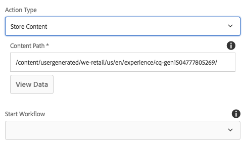

# Form Container Component (v1){#form-container-component-v}

The Core Component Form Container Component allows for the creation of simple submission forms.

## Usage {#usage}

The Form Container Component enabled the building of simple information submission forms and features by supporting simple WCM forms and by using a nested structure to allow additional form components.

By using the [setting dialog](form-container-v1.md#main-pars_title) the content editor can define what type of action form submission triggers, where the submitted content should be stored, and if a workflow should be triggered. The template author can use the [design dialog](form-container-v1.md#main-pars_title_1995166862) to define the allow components and their mappings similar to the design dialog for the [standard layout container in the template editor](/content/help/en/experience-manager/6-3/sites/authoring/using/templates#main-pars_title_1754153843).

## Version and Compatibility {#version-and-compatibility}

This document describes v1 of the Form Container Component, originally introduced with release 1.0.0 of the Core Components with AEM 6.3.

The following table lists the compatibility of v1 of the Form Container Component.

<table border="1" cellpadding="1" cellspacing="0" width="100%"> 
 <tbody>
  <tr>
   <td><strong>AEM Version</strong></td> 
   <td><strong>Form Container  Component v1</strong>  </td> 
  </tr>
  <tr>
   <td>6.3</td> 
   <td>Compatible</td> 
  </tr>
  <tr>
   <td>6.4</td> 
   <td>Compatible</td> 
  </tr>
 </tbody>
</table>

>[!CAUTION]
>
>This document describes v1 of the Form Container Component.
>
>For details of the current version of the Form Container Component, see the [Form Container Component](form-container.md) document.

## Settings Dialog {#settings-dialog}

The settings dialog allows the content author to define what actions are taken when the component is submitted. 

Depending on the selected **Action Type**, the available options within the container will change. The available action types are:

* [Mail](form-container-v1.md#main-pars_title_966511656)
* [Store Content](form-container-v1.md#main-pars_title_2065985840)
* [Submit Order](form-container-v1.md#main-pars_title_686874527)
* [Update Order](form-container-v1.md#main-pars_title_410109286)

Regardless of the type, there are [general settings](form-container-v1.md#main-pars_title_375403046) that apply to each action.

### Mail {#mail}

When the form is submitted, the mail action type will send an email to designated recipients.

* **Subject** - The subject of the email that will be sent on form submission
* **From** - The from email address of the email that will be send on form submission
* **To** - The addresses of the recipients who will receive an email upon form submission

    * Tap or click the **Add** button to add additional addresses
    * Tap or click the **Delete** button to remove an email address

* **CC** - The addresses of recipients who will receive a carbon copy the email sent upon form submission

    * Tap or click the **Add** button to add additional addresses
    * Tap or click the **Delete** button to remove an email address

### Store Content {#store-content}

When the form is submitted, the content of the form will be stored in a designated repository location.

* **Content Path** - Content repository path where submitted content is stored
* **View Data** - Tap or click to view stored submitted data as JSON
* **Start Workflow** - Configure to start a workflow with the stored content as payload upon form submission

### Submit Order {#submit-order}

When the form is submitted, the order will be submitted.

### Update Order {#update-order}

When the form is submitted, the order will be updated.

### General Settings {#general-settings}

Regardless of the action type selected, a thank you page can always be defined.

The user will be redirected to the specified page after completion of the form submission.

* Use the Selection Dialog to select a resource within AEM.
* If the thank you page is not in AEM, specify the absolute URL. Non-absolute URLs will be interpreted relative to AEM.
* Leave blank to redisplay the form after submission.

## Design Dialog {#design-dialog}

The design dialog allows the template author to define the allowed components and their mappings for the container similar to the design dialog for the [standard layout container in the template editor](/content/help/en/experience-manager/6-3/sites/authoring/using/templates#main-pars_title_1754153843).

## Technical Details {#technical-details}

The latest technical documentation about the Form Container Component [can be found on GitHub](https://github.com/adobe/aem-core-wcm-components/tree/master/content/src/content/jcr_root/apps/core/wcm/components/form/container/v1/container).

The entire core components project can be downloaded from GitHub.

Further details about developing Core Components can be found in the [Core Components developer documentation](developing.md). 
