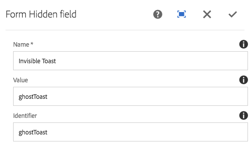

# Form Hidden Component{#form-hidden-component}

The Core Component Form Hidden component allows for the display of a hidden field.

## Usage {#usage}

The Core Component Form Hidden Component allows for the creation of hidden fields to pass information about the current page back to AEM and is intended to be used along with the [form container component](form-container.md).

The field properties can be defined by the content editor in the [configure dialog](form-hidden.md#main-pars_title).

## Version and Compatibility {#version-and-compatibility}

The current version of the Form Hidden Component is v2, which was introduced with release 2.0.0 of the Core Components in January 2018, and is described in this document.

The following table details all supported versions of the component, the AEM versions with which the versions of the component is compatible, and links to documentation for previous versions.

|Component Version|AEM 6.3|AEM 6.4|AEM 6.5|
|--- |--- |--- |--- |
|v2|Compatible|Compatible|Compatible|
|[v1](form-hidden-v1.md)|Compatible|Compatible|Compatible|

For more information about Core Component versions and releases, see the document [Core Components Versions](versions.md).

## Sample Component Output {#sample-component-output}

The following is sample taken from [We.Retail](https://helpx.adobe.com/experience-manager/6-4/sites/developing/using/we-retail.html).

### HTML {#html}

```
<div class="cmp cmp-form aem-GridColumn aem-GridColumn--default--12">
 <form method="POST" action="/content/we-retail/us/en/experience.html" id="new_form" name="new_form" enctype="multipart/form-data" class="aem-Grid aem-Grid--12 aem-Grid--default--12 ">
  <input type="hidden" name=":formstart" value="/content/we-retail/us/en/experience/jcr:content/root/responsivegrid/container">
   <div class="visible aem-GridColumn aem-GridColumn--default--12">
    <input type="hidden" id="ghostToast" name="Invisible Toast" value="ghostToast">
   </div>
 </form>
</div>
```

### JSON {#json}

```
"container": {
              "columnClassNames": "aem-GridColumn aem-GridColumn--default--12",
              "columnCount": 12,
              "gridClassNames": "aem-Grid aem-Grid--12 aem-Grid--default--12",
              ":items": {
                "hidden": {
                  "columnClassNames": "aem-GridColumn aem-GridColumn--default--12",
                  ":type": "weretail/components/form/hidden",
                  "name": "Invisible Toast",
                  "id": "ghostToast",
                  "value": "ghostToast"
                }
              },
              ":itemsOrder": [
                "hidden"
              ],
              ":type": "weretail/components/form/container"
            }
```

### Technical Details {#technical-details}

The latest technical documentation about the Form Hidden Component [can be found on GitHub](https://github.com/adobe/aem-core-wcm-components/blob/master/content/src/content/jcr_root/apps/core/wcm/components/form/hidden/v2/hidden).

Further details about developing Core Components can be found in the [Core Components developer documentation](developing.md). 

## Configure Dialog {#configure-dialog}

The configure dialog allows the content author to define the parameters of the hidden field.



* **Name**
  The name of the field, which is submitted with the form data
* **Value**
  The value of the field, which is submitted with the form data
* **Identifier**
  The identifier should be unique on the page and can be used to bind scripts to this form field

Because the Form Hidden component normally has no visible attributes, the component's placeholder in the editor displays the **Name** and **Value** field values if they are assigned in order to help the author identify the appropriate Form Hidden component.

 

## Design Dialog {#design-dialog}

There is no design dialog for the Form Hidden component.