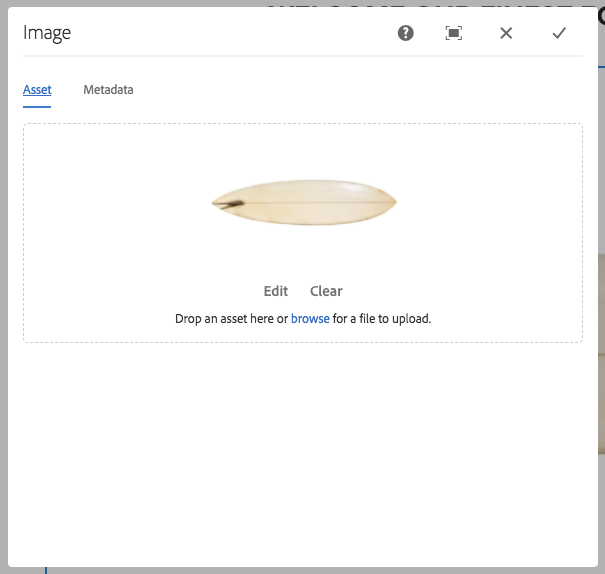
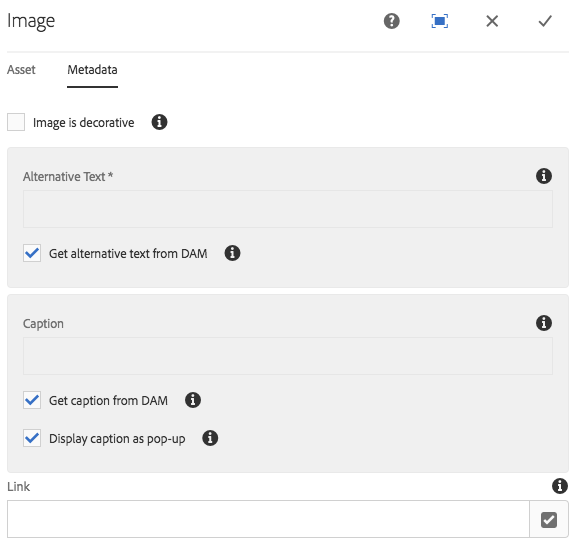
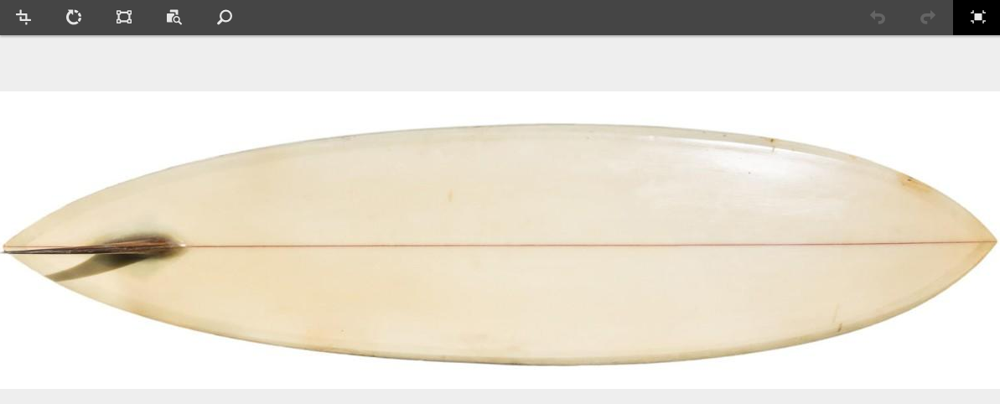
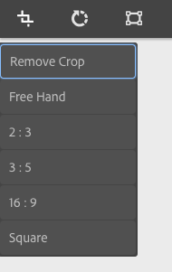
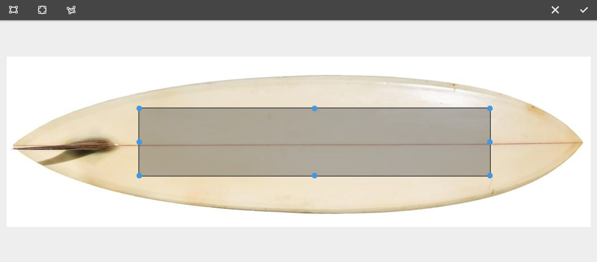
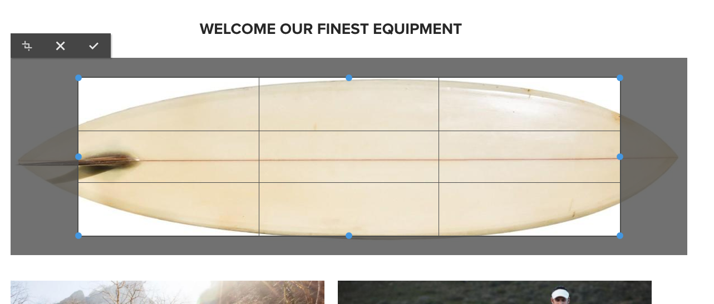

# Image Component{#image-component}

The Core Component Image Component is an adaptive image component that features in-place editing.

## Usage {#usage}

The Image Component features adaptive image selection and responsive behavior with lazy loading for the page visitor as well as easy image placement and cropping for the content author.

The image widths as well as cropping and additional settings can be defined by the template author in the [design dialog](#design-dialog). The content editor can upload or select assets in the [configure dialog](#configure-dialog) and crop the image in the [edit dialog](#edit-dialog). For added convenience, simple in-place modification of the image is also available.

## Responsive Features {#responsive-features}

The Image Component comes with robust responsive features ready right out of the box. At the page template level, the [design dialog](#design-dialog) can be used to define the default widths of the image asset. The Image Component will then automatically load the correct width to display depending on the size of the browser window. As the window is resized, the Image Component dynamically loads the correct image size on the fly. There is no need for component developers to worry about defining custom media queries since the Image Component is already optimized to load your content.

In addition, the Image Component supports lazy loading to defer loading of the actual image asset until it is visible in the browser, increasing the responsiveness of your pages.

## Version and Compatibility {#version-and-compatibility}

The current version of the Image Component is v2, which was introduced with release 2.0.0 of the Core Components in January 2018, and is described in this document.

The following table details all supported versions of the component, the AEM versions with which the versions of the component is compatible, and links to documentation for previous versions.

|Component Version|AEM 6.3|AEM 6.4|AEM 6.5|AEM as a Cloud Service|
|--- |--- |--- |--- |---|
|v2|Compatible|Compatible|Compatible|Compatible|
|[v1](image-v1.md )|Compatible|Compatible|Compatible|-|

For more information about Core Component versions and releases, see the document [Core Components Versions](versions.md).

## SVG Support {#svg-support}

Scalable Vector Graphics (SVG) are supported by the Image Component.

* Drag-and-drop of an SVG asset from DAM and upload of an SVG file upload from a local file system are both supported.
* The Adaptive Image Servlet streams the original SVG file is streamed (transformations are skipped).
* For an SVG image, the "smart images” and the "smart sizes” are set to an empty array in the image model.

### Security {#security}

For security reasons, the original SVG is never called directly by the Image Editor. It is called through ``. This prevents the browser from executing any scripts embedded in the SVG file.

>[!CAUTION]
>
>SVG support requires release 2.1.0 of the Core Components or higher along with [service pack 2](https://docs.adobe.com/content/help/en/experience-manager-64/release-notes/sp-release-notes.html) for AEM 6.4 or [service pack 3](https://helpx.adobe.com/experience-manager/6-3/release-notes/sp3-release-notes.html) for AEM 6.3 or higher to support [new image editor features](https://docs.adobe.com/content/help/en/experience-manager-64/developing/components/image-editor.html) within AEM.

## Sample Component Output {#sample-component-output}

To experience the Image Component as well as see examples of its configuration options as well as HTML and JSON output, visit the [Component Library](https://adobe.com/go/aem_cmp_library_image).

### Technical Details {#technical-details}

The latest technical documentation about the Image Component [can be found on GitHub](https://adobe.com/go/aem_cmp_tech_image_v2).

Further details about developing Core Components can be found in the [Core Components developer documentation](developing.md).

>[!NOTE]
>
>As of Core Components release 2.1.0, the Image Component supports [schema.org microdata](https://schema.org).

## Configure Dialog {#configure-dialog}

In addition to the standard [edit dialog](#edit-dialog) and [design dialog](#design-dialog), the image component offers a configure dialog where the image itself is defined along with its description and basic properties.

### Asset Tab {#asset-tab}

* **Image asset**
  * Drop an asset from the [asset browser](https://docs.adobe.com/content/help/en/experience-manager-cloud-service/sites/authoring/fundamentals/environment-tools.html) or tap the **browse** option to upload from a local file system.
  * Tap or click **Clear** to de-select the currently selected image.
  * Tap or click **Edit** to [mange the renditions of the asset](https://docs.adobe.com/content/help/en/experience-manager-cloud-service/assets/manage/manage-digital-assets.html) in the asset editor.

### Metadata Tab {#metadata-tab}

* **Image is decorative**
  Check if the image should be ignored by assistive technology and therefore does not require an alternative text. This applies to decorative images only.
* **Alternative text**
  Textual alternative of the meaning or function of the image, for visually impaired readers.
  * Get alternative text from DAM - When checked the image's alternative text will be populated with the value of the `dc:description` metadata in DAM.

* **Caption**
  Additional information about the image, displayed below the image by default.
  * **Get caption from DAM**
    When checked the image's caption text will be populated with the value of the `dc:title` metadata in DAM.  
  * **Display caption as pop-up**
    When checked, the caption won't be displayed below the image, but as a pop-up displayed by some browsers when hovering over the image.

* **Link**
  * Link the image to another resource.
  * Use the selection dialog to link to another AEM resource.
  * If not linking to an AEM resource, enter the absolute URL. Non-solute URLs will be interpreted as relative to AEM.

## Edit Dialog {#edit-dialog}

The edit dialog allows the content author to crop, modify the launch map, and zoom the image.

* Start Crop

  

  Selecting this option opens a drop-down for pre-defined crop proportions.

  * Choose the option **Free Hand** to define your own crop.
  * Choose the option **Remove Crop** to display the original asset.

  Once a crop option is selected, use the blue handles to size the crop on the image.

  

* Rotate Right

  

  Use this option to rotate the image 90° to the right (clockwise).

* Flip Horizontally

  

  Use this option to to flip the image horizontally or pivot the image 180° along the y-axis.

* Flip Vertically

  

  Use this option to to flip the image vertically or pivot the image 180° along the x-axis.

* Launch Map

  >[!CAUTION]
  >
  >The Launch Map feature requires release 2.1.0 of the Core Components or higher along with [service pack 2](https://docs.adobe.com/content/help/en/experience-manager-64/release-notes/sp-release-notes.html) for AEM 6.4 or [service pack 3](https://helpx.adobe.com/experience-manager/6-3/release-notes/sp3-release-notes.html) for AEM 6.3 or higher to support [new image editor features](https://docs.adobe.com/content/help/en/experience-manager-64/developing/components/image-editor.html) within AEM.

  

  Use this option to apply a launch map to the image. Selecting this option opens a new window allowing the user select the shape of the map:

  * **Add Rectangular Map**
  * **Add Circular Map**
  * **Add Polygon Map**
    * By default adds a triangle map. Double-click on a line of the shape to add a new blue resize handle on a new side.

  Once a map shape is selected, it is superimposed on the image allowing for resizing. Drag and drop the blue resize handles to adjust the shape.

  

  After sizing the launch map, click on it to open a floating toolbar to define the path of the link.

  * **Path**
    * Use the Path Picker option to select a path in AEM
    * If the path is not in AEM, use the absolute URL. Non-absolute paths will be interpreted relative to AEM.
  * **Alt text**
    Alternative description of the path destination
  * **Target**
    * **Same tab**
    * **New tab**
    * **Parent Frame**
    * **Top Frame**

  Tap or click the blue checkmark to save, the black x to cancel, and the red trash can to delete the map.

  

* Reset Zoom

  

  If the image has already been zoomed, use this option to reset the zoom level.

* Open Zoom Slider

  

  Use this option to display a slider to control the zoom level of the image.

  

The in-place editor can also be used to modify the image. Due to space limitations, only basic options are available in-line. For full edit options, use the full-screen mode.

>[!NOTE]
>
>Image edit operations (crop, flip, rotate) are not supported for GIF images. Any such changes made in edit mode to GIFs will not be persisted.

## Design Dialog {#design-dialog}

The design dialog allows the template author to define the cropping, upload, and rotation and upload options that the content author has when using this component.

### Main Tab {#main-tab}

On the **Main** tab you can define a list of widths in pixels for the image and the component will automatically load the most appropriate width based on browser size. This is an important part of the [responsive features](#responsive-features) of the Image Component.

In addition, you can define which general component options are automatically or disabled when the author adds the component to a page.

* **Enable lazy loading**
  Define if the lazy loading option is automatically enabled when adding the image component to a page.  
* **Image is decorative**
  Define if the decorative image option is automatically enabled when adding the image component to a page.
* **Get alternative text from DAM**
  Define if the option to retrieve the alternate text from the DAM is automatically enabled when adding the image component to a page.
* **Get caption from DAM**
  Define if the option to retrieve the caption from the DAM is automatically enabled when adding the image component to a page.
* **Display caption as pop-up**
  Define if the option to display the image caption as a pop-up is automatically enabled when adding the image component to a page.
* **Disable UUID Tracking**
  Check to disable the tracking of the image asset's UUID.

* **Widths**
  Defines a list of widths in pixels for the image and the component automatically loads the most appropriate width based on browser size.
  * Tap or click the **Add** button to add another size.
    * Use the grab handles to re-arrange the order of the sizes.
    * Use the **Delete** icon to remove a width.
  * By default images loading is ddeferreduntil they become visible.
    * Select the option **Disable lazy loading** to load the images upon page load.
* **JPEG Quality**
  The quality factor (in percentage from 0 and 100) for transformed (e.g. scaled or cropped) JPEG images.

>[!CAUTION]
>
>The JPEG Quality option is available as of release 2.2.0 of the Core Components.

>[!NOTE]
>
>As of release 2.2.0 of the Core Components, the Image Component adds the unique UUID attribute `data-asset-id` to the image asset to allow tracking and analysis of the number of views that individual assets receive.

### Features Tab {#features-tab}

On the **Features** tab you can define which options are available to the content authors when using the component including upload options, orientation, and cropping options.

* Source

  

  Select the option **Allow asset upload from file system** to allow content authors to upload images from his or her local computer. To force content authors to only select assets from AEM, de-select this option.

* Orientation

  

* **Rotate**
  Use this option to allow the content author to use the **Rotate Right** option.
* **Flip**
  Use this option to allow the content author to use the **Flip Horizontally** and **Flip Vertically** options.

  >[!CAUTION]
  >
  >The **Flip** option is disabled by default. Enabling it will display the **Flip Vertically** and **Flip Horizontally** buttons in the edit dialog of the image component, however the feature is not currently supported by AEM and any changes made using these options will not be persisted.

* Cropping

  

  Select the option **Allow crop** to allow the content author to crop the image in the component in the edit dialog.
  * Click **Add** to add a pre-defined crop aspect ratio.
  * Enter a descriptive name, which will be shown in the **Start Crop** dropdown.
  * Enter the numerical ratio of the aspect.
  * Use the drag handles to re-arrange the order of the aspect ratios
  * Use the trash can icon to delete an aspect ratio.

  >[!CAUTION]
  >
  >Note that in AEM, crop aspect ratios are defined as **height/width**. This differs from the conventional definition of width/height and is done for legacy compatibility reasons. The content authors will not be aware of any difference as long as you provide a clear name of the ratio since the name is shown in the UI and not the ratio itself.

### Styles Tab {#styles-tab-1}

The Image Component supports the AEM [Style System](authoring.md#component-styling).

## Adaptive Image Servlet {#adaptive-image-servlet}

The Image Component uses the Core Component's Adaptive Image Servlet. [The Adaptive Image Servlet](https://github.com/adobe/aem-core-wcm-components/wiki/The-Adaptive-Image-Servlet) is responsible for image processing and streaming and can be leveraged by developers in their [customizations of the Core Components](customizing.md).

>[!NOTE]
>
>Conditional requests via the `Last-Modified` header are supported by the Adaptive Image Servlet, but the caching of the `Last-Modified` header [needs to be enabled in the Dispatcher](https://docs.adobe.com/content/help/en/experience-manager-dispatcher/using/configuring/dispatcher-configuration.html#caching-http-response-headers).
>
>[The AEM Project Archetype](overview.md)'s sample Dispatcher configuration already contains this configuration.
