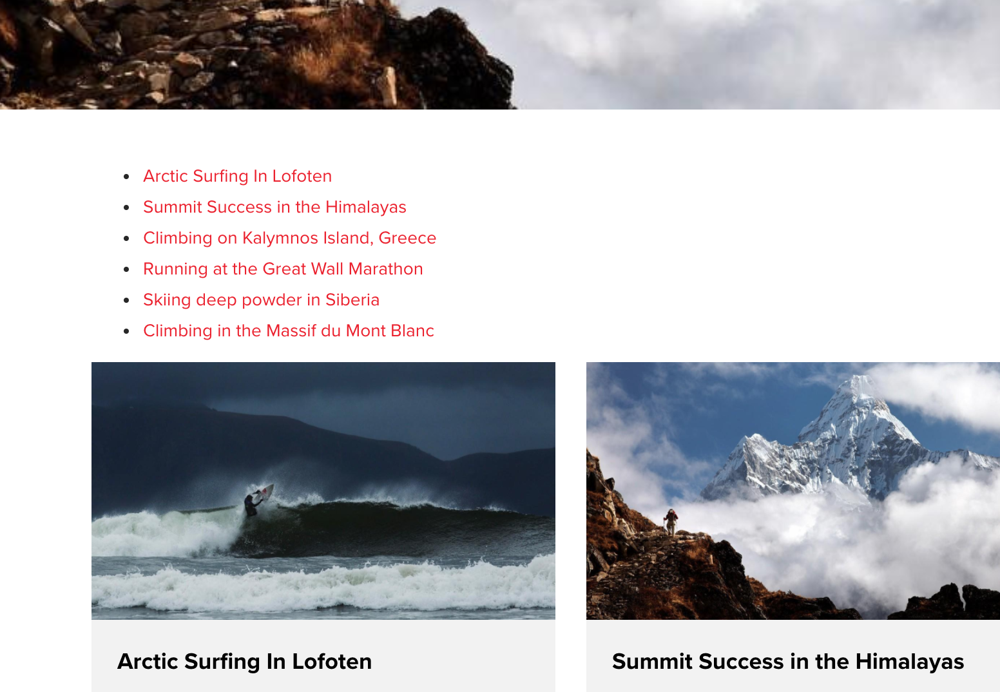
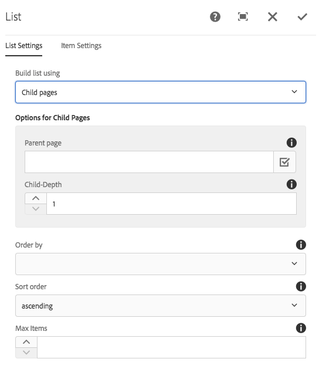
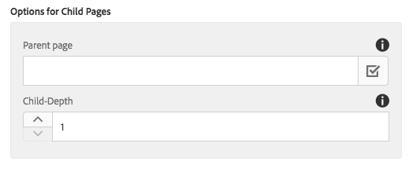
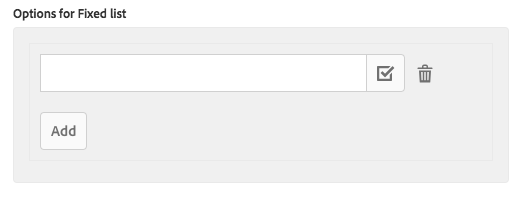
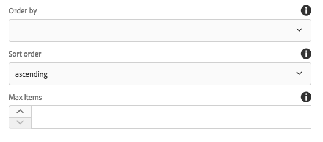
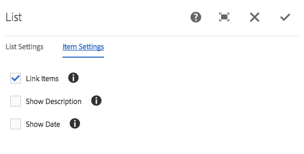
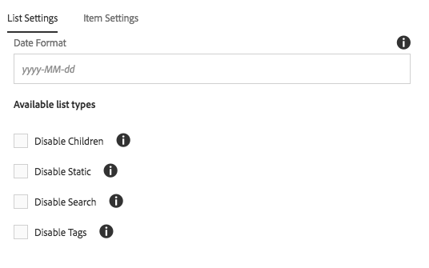

# List Component{#list-component}

The Core Component List Component allows for the easy creation of dynamic as well as static lists.

## Usage {#usage}

The List Component can be used to create for example a dynamic list of child pages or a static list of arbitrarily defined items. The type of lists available and formatting options can be defined by the template author in the [design dialog](list.md#main-pars_title_1995166862). The content editor can select from available list types and how to format the list elements in the [edit dialog](list.md#main-pars_title).

## Version and Compatibility {#version-and-compatibility}

The current version of the List Component is v2, which was introduced with release 2.0.0 of the Core Components in January 2018, and is described in this document.

The following table details all supported versions of the component, the AEM versions with which the versions of the component is compatible, and links to documentation for previous versions.

|Component Version|AEM 6.3|AEM 6.4|AEM 6.5|
|--- |--- |--- |--- |
|v2|Compatible|Compatible|Compatible|
|[v1](list-v1.md)|Compatible|Compatible|Compatible|

For more information about Core Component versions and releases, see the document [Core Components Versions](versions.md).

## Sample Component Output {#sample-component-output}

The following is sample taken from [We.Retail](https://helpx.adobe.com/experience-manager/6-4/sites/developing/using/we-retail.html).

### Screenshot {#screenshot}

 

### Component Library

To experience the List Component as well as see examples of its configuration options as well as HTML and JSON output, visit the [Component Library](http://opensource.adobe.com/aem-core-wcm-components/library/list.html).

### Technical Details {#technical-details}

The latest technical documentation about the List Component [can be found on GitHub](https://github.com/adobe/aem-core-wcm-components/blob/master/content/src/content/jcr_root/apps/core/wcm/components/list/v2/list).

Further details about developing Core Components can be found in the [Core Components developer documentation](developing.md). 

## Edit Dialog {#edit-dialog}

The edit dialog allows the content author to configure the list and the list items.

### List Settings Tab {#list-settings-tab}

The list can be built in different ways.

* [Child pages](list.md#child-pages)
* [Fixed list](list.md#fixed-list)
* [Search](list.md#search-options)
* [Tags](list.md#tags)

Regardless of how the list is built, there are [Sort Options](list.md#main-pars_title_1568376452) that can always be configured.

Depending on how the content author chooses to build the list, the additional configuration options will change.

#### Child Pages {#child-pages}

The list can be built of the child pages of the current page or another page.

* **Parent page**
  * The page whose child pages should make the list
  * Leave blank to use the current page

* **Child-Depth** 
  How many levels down in the hierarchy should be used

#### Fixed List {#fixed-list}

The list can be built using a fixed list of items.

Tap or click the **Add** button to inset a new item to the list.

* Enter text for the item in the list or use the **Selection Dialog** to choose an item from AEM.
* Use the drag handle to re-arrange the items in the list.
* Use the trash can icon to delete items in the list.

#### Search {#search-options}

The list can be built using the results of a search of AEM content.

* **Search query**
  The string for which a full-text search will be run to generate the list elements
* **Search in**
  Where the search should be run
  * Use the **Selection Dialog** to choose the location in AEM
  * Use current page if left blank

#### Tags {#tags}

The list can be built using pages that match certain tags under a particular location.

* **Parent page**
  Where the tag matching should start
  * Use the **Selection Dialog** to choose the location in AEM
  * Use current page if left blank
* **Tags**
  Which tags should be matched
  * Use the **Browse** dialog to select the tags
* **Match**
  Define which kind of match should qualify a page to be included in the list
  * **any tag**
  * **all tags**

#### Sort Options {#sort-options}

Regardless of how you choose to build the list, there are certain sorting options that can always be defined.

* **Order by**
  How the elements should be ordered
  * **Title**
  * **Last modified date**
* **Sort Order**
  The order in which the items should be ordered
  * **ascending**
  * **descending**
* **Max Items**
  Maximum number of items displayed in list.
  * Leave empty to return all items.

### Item Settings Tab {#item-settings-tab}

Using the Item Settings tab, the formatting of the list elements can be configured.

* **Link Items**
  Link items to the corresponding page
* **Show Description**
  Show descriptions of the link item
* **Show Date**
  Show modification date of the link item

## Design Dialog {#design-dialog}

The design dialog allows the template author to define what types of lists should be allowed to the content authors as well as the available item settings.

### List Settings {#list-settings}

On the **List Settings** tab, the date format can be defined as well as what type of lists should be available in the component to the content authors.

* **Date Format**
  Format to use for the display of the last modification date
* **Disable Children**
  Disable the children list type in the component
* **Disable Static**
  Disable the static list type in the component
* **Disable Search**
  Disable the search list type in the component
* **Disable Tags**
  Disable tags list type in the component

### Item Settings {#item-settings}

On the **Item Settings** tab, the formatting options for the individual list elements that should be available in the component for the content authors can be defined.

**Link Items**
  Enable Link Items option in the [edit dialog](list.md#main-pars_title_550499279)
**Show Descriptions**
  Enable Show Descriptions option in the [edit dialog](list.md#main-pars_title_550499279)
**Show Date**
  Enable Show Date option in the [edit dialog](list.md#main-pars_title_550499279)

### Styles Tab {#styles-tab}

The Image Component supports the AEM [Style System](authoring.md#component-styling).