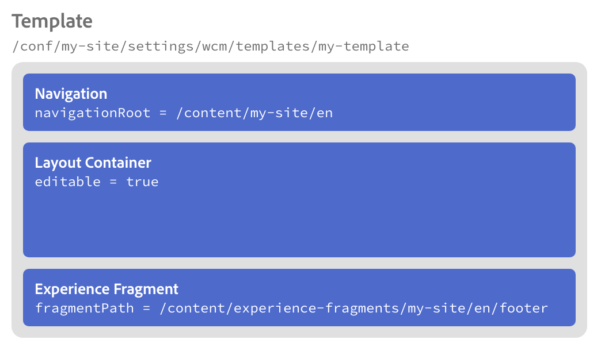
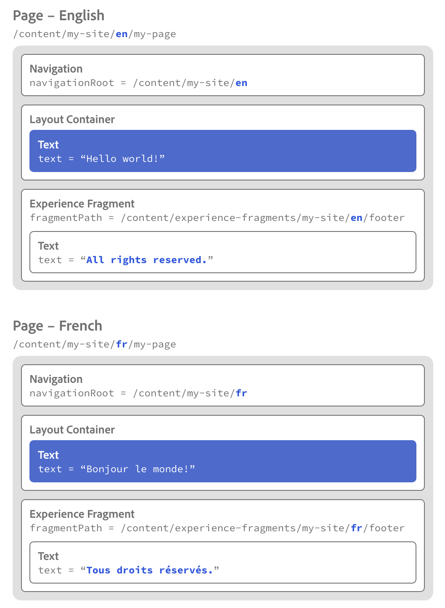

# Localization Features of the Core Components {#localization-features-of-the-core-components}

Many websites require content to be delivered in a localized format across multiple languages and geographies. The Core Components feature smart reference resoultion to make it simple to create a unified template for all of your localized content that automatically adapts based on your localized site structure.

## Example - Localized Page with Navigation and Footers {#example}

Most sites require a footer to be present across all pages. These footers are generally consistent across all content of the page. However for a localized content page, a localized version of that header or footer needs to be displayed.

Similarly a navigation component usually must be displayed across all pages. However it will need to reflect the content of the localized pages as well.

Using the localization features of the [Navigation Core Component](navigation.md) and [Experience Fragment Core Component](experience-fragment.md) along with the [editable templates of AEM](https://docs.adobe.com/content/help/en/experience-manager-64/authoring/siteandpage/templates.html).

## The Content Structure {#content-structure}

All of the localization features of AEM and its Core Components rely on a clear and logical content structure for your localized content.

Let's say that your site is simply called `my-site` and is located here:

```
/content/my-site
```

Let's also say that you author your site in English and offer it in French as well. So if you have a simple page called `my-page` it would be found in two localization branches in your site's content tree:

```
/content
\-- my-site
   +-- en
       \-- my-page
   \-- fr
       \-- my-page
```

It is under these localization branches is where you will create additional sites pages.

Page footers are generally made using Experience Fragments so you will need an English and French version just like your pages. However Experience Fragments are not pages, but are rather parts of pages that can be reused, so they do not live directly under `/content` as the rest of your pages. Instead they live under their own folder, but since they also must be localized, their structure must mirror the localization structure of your site.

```
/content
+-- experience-fragments
   +-- en
      +-- footer
   \-- fr
      +-- footer
\-- my-site
   +-- en
      \-- my-page
   \-- fr
      \-- my-page
```

It is through the mirrored localization structure that the Core Components can find the necessary localized content for a corresponding page.

## Page Footer - Experience Fragment {#footer}

The Experience Fragment Component is very flexible and is well-suited for a page header or footer.

Because our hypothetical website is offered in English and French, we will need to create two Experience Fragments, both called `footer` [in the location we described previously.](#content-structure)


## Page Template {#template}

Because the footer will appear on every page, we will need to add the Experience Fragment to our standard page template.

Our template is simply called `my-template` and is located with our other templates:

```
/conf/my-site/settings/wcm/templates/my-template
```

To this template we will add the basic components that we want our pages to be based on.

* Navigation
  * The Navigation Component will appear at the top of every page
  * In the Navigation Component we define the navigation root, telling the component where the site's navigation structure starts
  * Based on the navigation root, the component can find the corresponding localized content automatically.
* Layout Container
  * Every page will contain an editable Layout Container Component so that authors can place additional content on the page.
* Experience Fragment
  * We point the Experinece Fragment Component to the fragment path in our authoring language of the fragment that represents the footer.
  * Based on that fragment's path and the structure of the experience fragments that mirrors the localized page structure, the component can find the corresponding localized content automatically.

  

## Pages {#pages}

By doing the hard work in setting up the site structure and template, the author simply needs to add the necessary content to the pages. Because of the localization logic of the compoentns, the navigation and footers will be automatically localized.

For example, the author would only need to add a text component to the English and French pages (represented in blue below).

The Navigation Component and Experience Fragment Component know to automatically display the correct content based on the localization structure and the location of the page itself (represented in white below).



## Fitting It All Together {#fitting-it-all-together}

Here is the complete picture of how these simple, but powerful element work together to deliver localized pages for the content authors.


