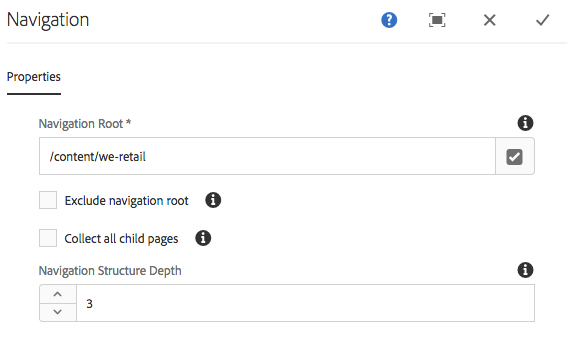
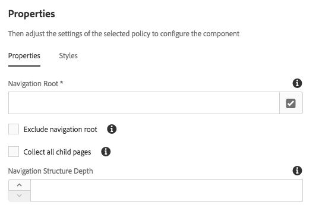

# Navigation Component{#navigation-component}

The Navigation Component allows users to easily navigate a globalized site structure.

## Usage {#usage}

The navigation component allows any navigation hierarchy that can be built from the live copies of a blueprint, from the language copies of a language master, or from a simple tree of pages. It allows users of the page to easily navigate a site structure.

The [edit dialog](#edit-dialog) allows the content author to define the navigation root page along with the depth of navigation. The [design dialog](#design-dialog) allows the template author to define default values for the navigation root and depth.

## Version and Compatibility {#version-and-compatibility}

The current version of the Navigation Component is v1, which was introduced with release 2.0.0 of the Core Components in January 2018, and is described in this document.

The following table details all supported versions of the component, the AEM versions with which the versions of the component is compatible, and links to documentation for previous versions.

|Component Version|AEM 6.3|AEM 6.4|AEM 6.5|
|--- |--- |--- |--- |
|v1|Compatible|Compatible|Compatible|

For more information about Core Component versions and releases, see the document [Core Components Versions](versions.md).

## Sample Component Output {#sample-component-output}

To experience the Navigation Component as well as see examples of its configuration options as well as HTML and JSON output, visit the [Component Library](http://opensource.adobe.com/aem-core-wcm-components/library/navigation.html).

## Technical Details {#technical-details}

The latest technical documentation about the Navigation Component [can be found on GitHub](https://github.com/adobe/aem-core-wcm-components/blob/master/content/src/content/jcr_root/apps/core/wcm/components/navigation/v1/navigation).

Further details about developing Core Components can be found in the [Core Components developer documentation](developing.md). 

>[!NOTE]
>
>As of Core Components release 2.1.0, the Navigation Component supports [schema.org microdata](https://schema.org).

## Edit Dialog {#edit-dialog}

In the edit dialog, the content author can define the root page for navigation and the depth of the navigation structure.

* **Navigation Root**
  The root page, which will be used to generate the navigation tree.
* **Exclude navigation root**
  Exclude the navigation root in the resulting tree, include its descendants only.  
* **Collect all child pages**
  Collect all pages that are descendants of the navigation root.  
* **Navigation Structure Depth**
  Defines how many levels down the navigation tree the component should display relative to the navigation root (only available when **Collect all child pages** is not selected).

## Design Dialog {#design-dialog}

The design dialog allows the template author to set the default values for the navigation root page and navigation depth that are presented to the content authors.

### Properties Tab {#properties-tab}

* **Navigation Root**
  The default value of the root page of the navigation structure, which will be used to generate the navigation tree and defaulted when the content author adds the component to the page.  
* **Exclude navigation root**
  The default value of the option to exclude the navigation root in the resulting tree.  
* **Collect all child pages**
  The default value of the option to collect all pages that are descendants of the navigation root.  
* **Navigation Structure Depth**
  The default value of the navigation structure depth.

### Styles Tab {#styles-tab}

The Navigation Component supports the AEM [Style System](authoring.md#component-styling).